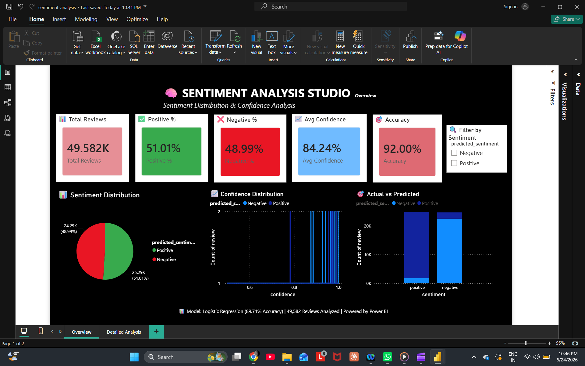

# 🧠 Sentiment Analysis System

[](https://python.org)
[](https://streamlit.io)
[](https://scikit-learn.org)

---

## 📌 Overview

A **professional Sentiment Analysis System** that classifies text into **Positive** or **Negative** sentiments with **89.71% accuracy**. Built with machine learning, deployed as an interactive web application.

**Live Demo:** [http://localhost:8501](http://localhost:8501)

---

## ✨ Features

| Feature | Description |
|---------|-------------|
| 🔮 **Real-time Prediction** | Instant sentiment analysis with confidence scores |
| 📁 **Batch Processing** | Upload CSV files for bulk analysis |
| 📊 **Analytics Dashboard** | Visualize sentiment patterns |
| ☁️ **Word Cloud** | Generate word clouds from any text |
| 📥 **Export Results** | Download predictions as CSV |
| 📈 **Power BI Dashboard** | Professional visualization |

---

## 📊 Model Performance

| Metric | Value |
|--------|-------|
| **Accuracy** | **89.71%** |
| **F1 Score** | **89.85%** |
| **Best Model** | Logistic Regression (Tuned) |
| **Features** | TF-IDF + Bigrams (10,000) |

---

## 🚀 Quick Start

### One-Command Setup (Windows)
```bash
python -m venv venv
venv\Scripts\activate
pip install -r requirements.txt
python main.py
streamlit run app.py
```

### One-Command Setup (Mac/Linux)
```bash
python3 -m venv venv
source venv/bin/activate
pip install -r requirements.txt
python3 main.py
streamlit run app.py
```

### Step-by-Step

**1. Clone the Repository:**
```bash
git clone https://github.com/shivathmika-9927/sentiment-analysis.git
cd sentiment-analysis
```

**2. Create Virtual Environment:**
```bash
# Windows
python -m venv venv
venv\Scripts\activate

# Mac/Linux
python3 -m venv venv
source venv/bin/activate
```

**3. Install Dependencies:**
```bash
pip install -r requirements.txt
```

**4. Train the Model (First Time Only):**
```bash
python main.py
```
Select **Option 1** when prompted.

**5. Run the Web Application:**
```bash
streamlit run app.py
```

**6. Access the App:** Open `http://localhost:8501`

---

## 📁 Project Structure

```
sentiment-analysis/
├── app.py                    # Streamlit Web App
├── main.py                   # Complete Pipeline
├── requirements.txt          # Dependencies
├── README.md                 # Documentation
│
├── src/
│   ├── data_preprocessing.py
│   ├── feature_engineering.py
│   ├── train_model.py
│   ├── evaluate_model.py
│   ├── tune_model.py
│   └── eda.py
│
├── data/
│   ├── raw/
│   └── processed/
│
├── models/                   # Saved Models
├── outputs/                  # Visualizations
└── dashboard/                # Power BI Dashboard
```

---

## 📸 Screenshots

### Power BI Dashboard


---

## 📊 Power BI Dashboard

**Download:** [📥 sentiment_analysis_dashboard.pbix](https://github.com/shivathmika-9927/sentiment-analysis/raw/master/dashboard/sentiment_analysis_dashboard.pbix)

**To View:**
1. Download the `.pbix` file
2. Open with [Power BI Desktop](https://powerbi.microsoft.com/en-us/desktop/)

---

## 🔧 Technologies Used

| Category | Technologies |
|----------|--------------|
| **Language** | Python 3.9+ |
| **ML Libraries** | Scikit-learn, Pandas, NumPy |
| **NLP** | NLTK, WordCloud |
| **Web App** | Streamlit |
| **Dashboard** | Power BI |
| **Version Control** | Git, GitHub |

---

## 👨‍💻 Author

**Nagashivathmika Durga Pu**

- GitHub: [@shivathmika-9927](https://github.com/shivathmika-9927)
- LinkedIn: [Nagashivathmika Durgapu](https://www.linkedin.com/in/nagashivathmika9)
- Email: nagashivathmikadurgapu9@gmail.com

---

## ⭐ Star This Project

If you found this project useful, please give it a star! ⭐

---

**Made with ❤️ and Python**
